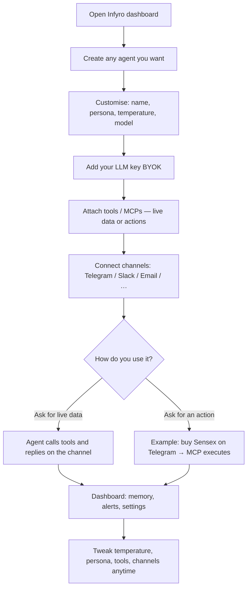
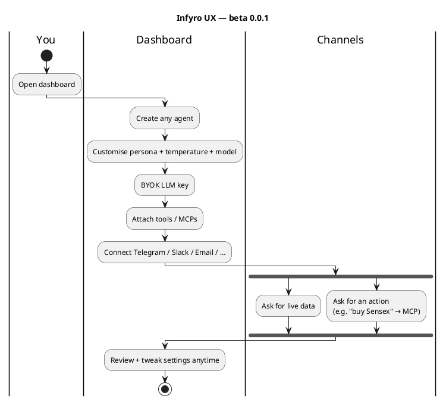
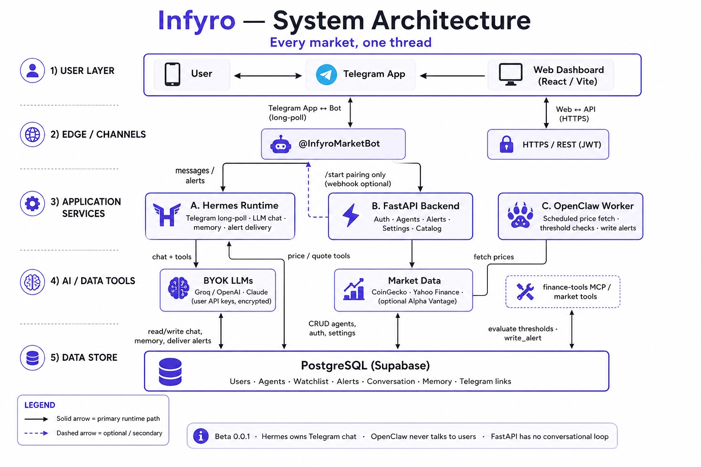

# Infyro

**Every market, one thread.** · beta 0.0.1

Infyro is for **anyone** who wants personal AI agents without building infrastructure.  
You create an agent, customise how it thinks (persona, model, **temperature**, tools), connect it to the places you already live — **Telegram, Slack, email, and more** — and talk to it there. It can fetch **live data** or trigger **real actions** through tools/MCPs (example: you message “buy Sensex” on Telegram → a trading MCP carries it out).

This repo’s first niche is **markets** (prices + alerts) as a working demo. The product direction is broader: **your agents · your channels · your tools**.

> **Beta 0.0.1** — early build. Dashboard + Telegram path are live; Slack/email and more action MCPs are part of the vision / next iterations.

## User experience flow

How easy it is to customise and use an agent (beta 0.0.1):



Full PlantUML: [`docs/user-experience-flow.puml`](docs/user-experience-flow.puml)



**What you customise on the dashboard (beta):** agent name & look, persona text, LLM provider + key, temperature/style, which tools/sources are bound, channel linking (Telegram live today), pause/resume, memory & conversation history, alerts.

## Architecture



| Role | Does | Must not |
|------|------|----------|
| Hermes | Channel runtime (Telegram today): chat, memory, deliver alerts | Own cron jobs |
| OpenClaw worker | Background checks / tool-driven jobs | Talk to users directly |
| FastAPI | Auth, agents, settings, catalog | Conversational loop |
| Tools / MCP | Live data **and** actions | — |

## Repo layout

```
apps/api/          FastAPI
frontend/          React dashboard (Vite)
packages/db/       Models + migrations
packages/*_mcp/    Tools (demo: markets)
runtimes/hermes/   Channel runtime (Telegram)
runtimes/openclaw/ Background worker
scripts/           migrate, seed, doctor, start-all
docs/              Deploy, UX PlantUML, architecture
```

## Local quick start

```bash
cp .env.example .env
cp frontend/.env.example frontend/.env
# set FERNET_KEY, JWT_SECRET, TELEGRAM_BOT_TOKEN

docker compose up -d          # optional local Postgres on :55432
uv sync
./scripts/migrate.sh
./scripts/seed.sh

# API
set -a && source .env && set +a
uv run uvicorn infyro_api.main:app --host 127.0.0.1 --port 8000

# Dashboard
cd frontend && npm install && npm run dev

# Telegram channel runtime (separate terminal)
uv run python runtimes/hermes/runtime.py

# Optional background worker
uv run python runtimes/openclaw/market_worker.py --once
```

- UI: http://127.0.0.1:5174  
- API: http://127.0.0.1:8000/docs  

Or: `./scripts/start-all.sh` (API + Hermes + worker + Vite).

## Telegram bot (BotFather)

1. `@BotFather` → `/newbot`
2. Put token + username in `.env`
3. Run Hermes; keep webhook deleted while using long-poll

## Production

See **[docs/DEPLOY.md](docs/DEPLOY.md)** for **Render** step-by-step (API + Hermes worker + static UI).

Set `INFYRO_DEV_MODE=0` and `VITE_SKIP_AUTH=0` before a real launch.

## Scripts

- `./scripts/migrate.sh` — Alembic upgrade  
- `./scripts/seed.sh` — catalog seed  
- `./scripts/doctor.sh` — health check  
- `./scripts/start-all.sh` — local all-in-one  
