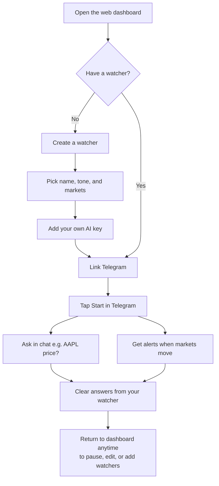
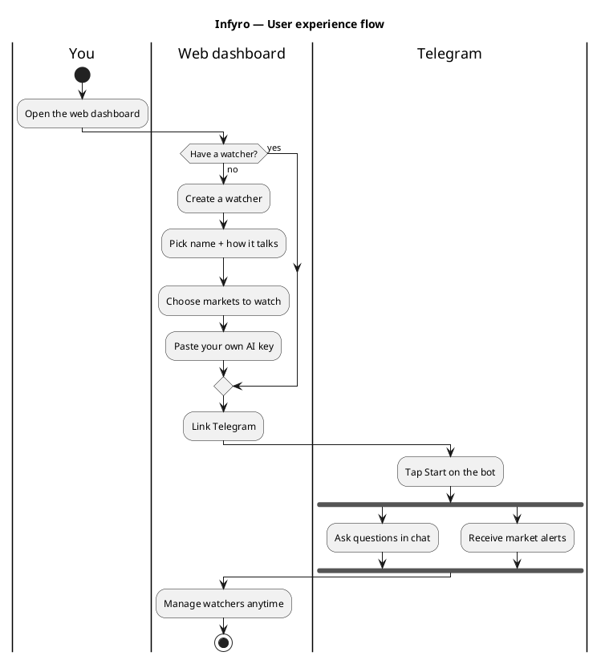

# Infyro

**Every market, one thread.** · beta 0.0.1

Infyro is built for **everyday people**, not just developers or traders.  
It makes personal AI useful in plain language: create a “watcher,” talk to it on Telegram, and get market updates and alerts without writing code or learning complicated tools. You bring your own AI key (BYOK) — so you stay in control of cost and privacy.

Telegram markets co-pilot + simple web dashboard. Watch stocks and crypto, ask questions in chat, get notified when something moves.

## User experience flow

How a non-technical person uses Infyro end-to-end:



PlantUML source (same flow): [`docs/user-experience-flow.puml`](docs/user-experience-flow.puml)



## Architecture


| Role | Does | Must not |
|------|------|----------|
| Hermes | Telegram, LLM chat, deliver alerts | Own cron price jobs |
| OpenClaw worker | Fetch prices, write alerts | Telegram / LLM |
| FastAPI | REST + JWT + OTP | Chat loop |
| finance-tools MCP | Typed Postgres tools | — |

## Repo layout

```
apps/api/          FastAPI
frontend/          React dashboard (Vite)
packages/db/       Models + migrations
packages/*_mcp/    Market / finance tools
runtimes/hermes/   Telegram + chat
runtimes/openclaw/ Price worker
scripts/           migrate, seed, doctor, start-all
docs/              Deploy notes, UX PlantUML, architecture image
```

## Local quick start

```bash
cp .env.example .env
cp frontend/.env.example frontend/.env
# set FERNET_KEY, JWT_SECRET, TELEGRAM_BOT_TOKEN

docker compose up -d          # optional local Postgres on :55432
uv sync
./scripts/migrate.sh
./scripts/seed.sh

# API
set -a && source .env && set +a
uv run uvicorn infyro_api.main:app --host 127.0.0.1 --port 8000

# Dashboard
cd frontend && npm install && npm run dev

# Telegram bot (separate terminal)
uv run python runtimes/hermes/runtime.py

# Optional alerts worker
uv run python runtimes/openclaw/market_worker.py --once
```

- UI: http://127.0.0.1:5174  
- API: http://127.0.0.1:8000/docs  

Or: `./scripts/start-all.sh` (API + Hermes + worker + Vite).

## Telegram bot (BotFather)

1. `@BotFather` → `/newbot`
2. Put token + username in `.env`
3. Run Hermes; keep webhook deleted while using long-poll

## Production

See **[docs/DEPLOY.md](docs/DEPLOY.md)** for **Render** step-by-step (API + Hermes worker + static UI).

Set `INFYRO_DEV_MODE=0` and `VITE_SKIP_AUTH=0` before a real launch.

## Scripts

- `./scripts/migrate.sh` — Alembic upgrade  
- `./scripts/seed.sh` — MCP catalog seed  
- `./scripts/doctor.sh` — health check  
- `./scripts/start-all.sh` — local all-in-one  
